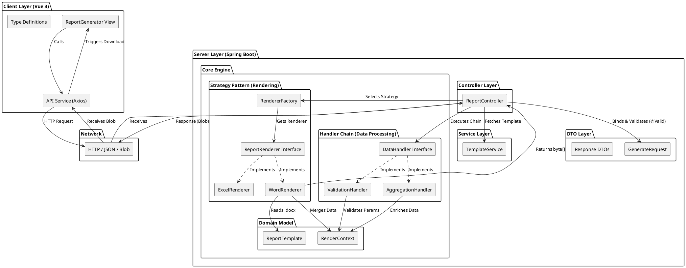
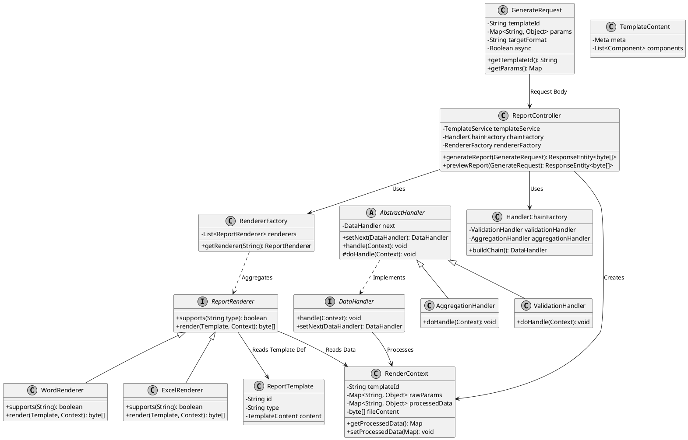
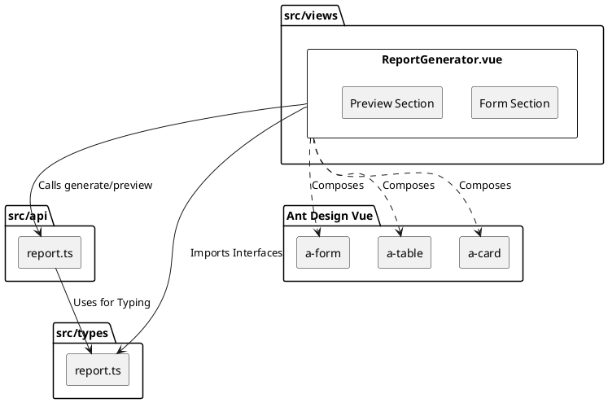
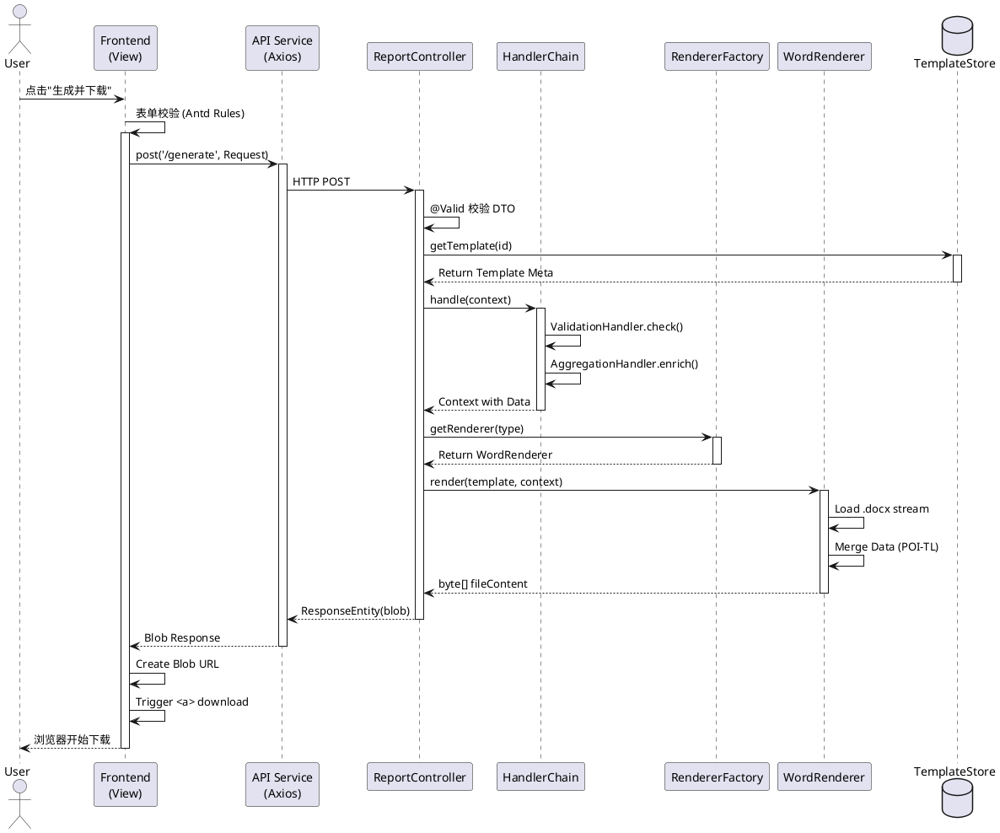
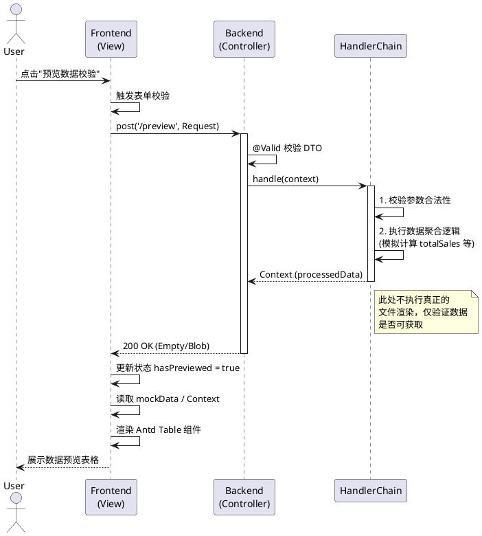

# 系统设计

## 前言

本文档详细描述了基于 Spring Boot 2.7 + Vue 3 (Ant Design) 的动态报表生成系统的架构设计。

系统采用前后端分离模式，后端通过策略模式支持多格式渲染，通过责任链模式处理数据聚合与校验，前端提供可视化配置与实时预览功能。

## 技术选型 

| 层级 | 技术组件 | 说明 |
| :--- | :--- | :--- |
| 前端 | Vue 3 + TypeScript | 核心框架，保证类型安全 |
| UI 库 | Ant Design Vue 4.x | 企业级 UI 组件库 |
| 构建工具 | Vite | 快速开发与构建 |
| 后端 | Spring Boot 2.7 | 核心业务逻辑容器 |
| 模板引擎 | POI-TL / EasyExcel | Word/Excel 渲染核心 |
| 设计模式 | 策略模式、责任链模式 | 解耦渲染逻辑与数据处理 |
| 校验机制 | Hibernate Validator | 参数合法性校验 |


## 核心设计模式应用 

* 策略模式 (Strategy Pattern): 用于处理不同的报表格式（Word, PPT, Excel, PDF）和不同的数据处理算法。 
* 责任链模式 (Chain of Responsibility): 用于数据源的校验、清洗、转换、聚合流程，支持动态插拔处理节点。 
* 组合模式 (Composite Pattern): 用于报表模版的层级结构（报表由多个区块组成，区块由多个组件/占位符组成）。 
* 工厂模式 (Factory Pattern): 用于创建具体的渲染器或图表组件实例。 
* 观察者模式 (Observer Pattern): 用于异步生成大报表时的状态通知。


## 架构分层图


## 核心模块详细设计

### 后端核心类设计

展示了数据处理链（Chain of Responsibility）和渲染策略（Strategy）的结构。



#### 模块职责说明

* DTO Layer: GenerateRequest 负责接收前端 JSON，通过 @Valid 注解触发 JSR-303 校验。
* Handler Chain:
** ValidationHandler: 校验参数完整性、业务规则（如日期范围）。
** AggregationHandler: 调用外部服务或数据库，补充模版所需的动态数据（如计算总和、增长率），将结果存入 RenderContext.processedData。
* Strategy Pattern:
** RendererFactory: 根据 template.type 或 request.targetFormat 动态选择渲染器。
** WordRenderer: 使用 POI-TL 加载 .docx 模版，合并数据，输出字节流。
* Controller: 协调上述组件，处理文件流的 HTTP 响应头（Content-Disposition）。


### 前端核心组件设计

组件结构图



### 关键业务流程时序图

#### 报表生成流程 (同步)

此流程描述了从用户点击“导出”到浏览器下载文件的完整过程。



#### 数据预览与校验流程

此流程描述用户点击“预览”时，后端仅进行数据校验和模拟渲染，前端展示模拟表格的过程。



### 数据模型设计

请求对象 (GenerateRequest)

| 字段 | 类型 | 必填 | 说明 |
| :--- | :--- | :--- | :--- |
| `templateId` | String | 是 | 模版唯一标识 |
| `params` | Map | 是 | 动态参数集合 (标题、日期等) |
| `targetFormat` | String | 否 | 覆盖默认格式 (WORD/EXCEL/PDF) |
| `async` | Boolean | 否 | 是否异步处理 (默认 false) |


渲染上下文 (RenderContext)

| 字段 | 类型 | 说明 |
| :--- | :--- | :--- |
| `rawParams` | Map | 原始输入参数 |
| `processedData` | Map | 经过责任链处理后的完整数据 (含聚合数据) |
| `fileContent` | byte[] | 最终生成的文件二进制流 |


### 模版管理子系统 (Template Management)

模版数据结构设计 为了支持在线编辑和多种格式，模版不直接存储二进制文件，而是存储为 JSON 结构化描述 (DSL)。

模版元数据表

```json
{
  "meta": { "format": "DOCX", "author": "system" },
  "layout": [
    {
      "id": "section_1",
      "type": "HEADER",
      "components": [
        { "type": "TEXT", "placeholder": "${report.title}", "style": {...} },
        { "type": "IMAGE", "placeholder": "${company.logo}", "width": 100 }
      ]
    },
    {
      "id": "section_2",
      "type": "CHART_CONTAINER",
      "chartConfig": { "templateId": "bar_chart_v1", "dataSourceRef": "ds_sales_01" },
      "placeholder": "${chart.sales_bar}"
    }
  ]
}
```

### 在线编辑器

* 技术选型: 使用 Monaco Editor 编辑 JSON，或基于 Konva.js / Fabric.js 实现拖拽式可视化编辑。
* 占位符定义: 提供UI界面让用户插入 ${variable}，支持类型选择（文本、图片、循环列表、表达式）。
* 内置模版库: 预置一组标准 Chart Config JSON（如柱状图、饼图配置），用户可拖入画布并绑定数据源。

### 数据处理引擎

责任链设计

